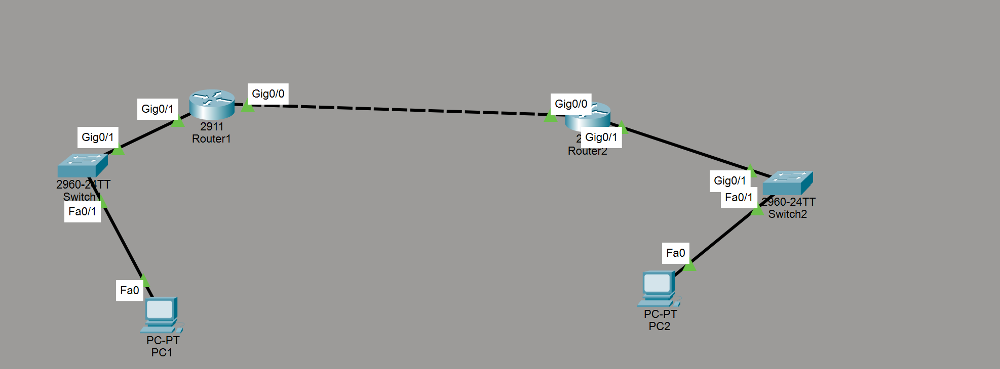

# Cisco--Dynamic-Routing-with-RIP-and-EIGRP

## 📌 Project Overview
This project demonstrates **dynamic routing** in a small network using Cisco Packet Tracer.  
The topology consists of **two routers connected together**, each serving its own LAN through a switch, with end devices on both sides.

Dynamic routing is configured using **EIGRP** and **RIP** to automatically share routing information between routers, enabling seamless end-to-end communication.

---

## 🖧 Network Topology
- 2 Cisco 2911 Routers  
- 2 Cisco 2960 Switches  
- 2 End Devices (PCs)  
- Point-to-point router interconnection  

---

## 🌐 IP Addressing Scheme

### Left LAN (192.168.1.0/24)

| Device | IP Address | Default Gateway |
|--------|-----------|----------------|
| PC1    | 192.168.1.2 | 192.168.1.1 |
| Router1 (LAN) | 192.168.1.1 | — |

---

### Right LAN (192.168.3.0/24)

| Device | IP Address | Default Gateway |
|--------|-----------|----------------|
| PC2    | 192.168.3.2 | 192.168.3.1 |
| Router2 (LAN) | 192.168.3.1 | — |

---

### Router-to-Router Link

| Router | Interface IP |
|--------|--------------|
| Router1 | 10.0.0.1/30 |
| Router2 | 10.0.0.2/30 |

---

## 🖼 Topology

